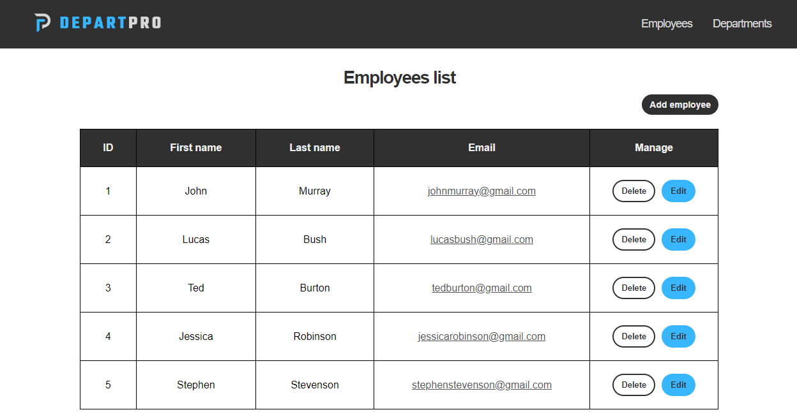

# DepartPro

DepartPro is a full stack web application that helps companies manage employees and departments by allowing to create, delete or update them from the lists. With this app, you can easily contact a specific employee via email with one single click.
</br></br>

<p align="center">
    
</p>

## Installation

To install the project, download the zip directly from here or paste this code on the command line:

```
git clone https://github.com/DanielJHV/depart-pro.git
```

Run the backend application that will start on http://localhost:8080.</br>
Then, run the frontend application by executing these commands:

```
cd depart-pro/frontend
npm install
npm run dev
```

After that, go to http://localhost3000 where the application is running.

## Features

- View, create, delete and update departments or employees.
- Contact a specific employee via email with one click.
- When creating an employee you have to specify his department.
- Form validation that doesn't allow creating or updating from the lists without completing every field.
- User-friendly interface that allows to do all the operations fast and easy.
  </br></br>

<p align="center">
    
</p>

<p align="center">
    
</p>

<p align="center">
    
</p>
